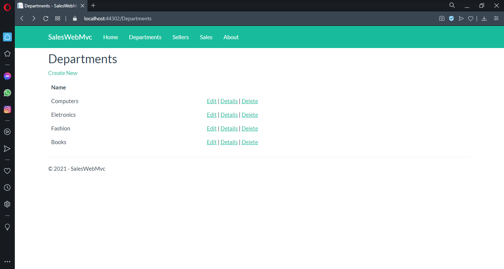
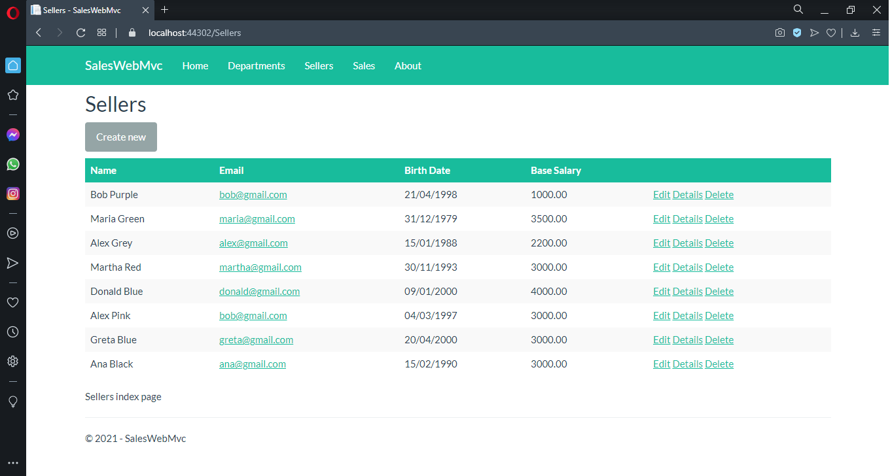
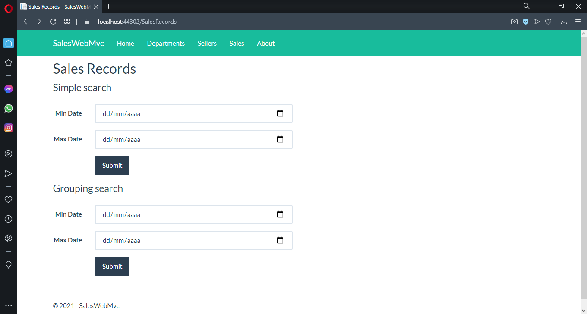
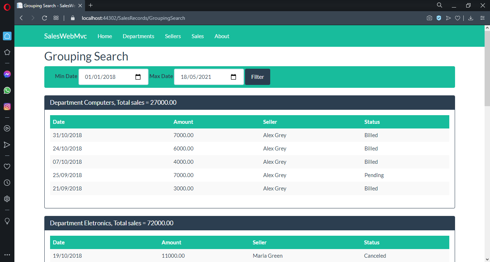

# Sales Web MVC :globe_with_meridians:

Este é um projeto que fiz ao final de um curso de C# na Udemy, do professor [Nélio Álves](https://www.udemy.com/user/nelio-alves/). Ele se trata basicamente de um site onde é possível fazer um "gerenciamento de loja" bem simplificado. É possível consultar vendedores, vendas e departamentos.

Com esse projeto, pude ter uma noção básica sobre:

* ASP.NET Core
* Model-View-Controller (MVC)
* Entity Framework
* MySQL
* LINQ

O projeto foi feito em ASP.NET 2.1, mas já está sendo atualizado para a versão do ASP.NET 5.

---

## Screenshots :camera:

